# Orbit Blue Laundry Controller

## First: This project involves Fire, Moving Parts, and Mains Electricity. This can result in burning the place down, being maimed, or death so don't attempt unless you know what you are doing!

### What this is:
An ESP32 firmware designed to talk to a server laundry card tap system (Currently closed source).
RFID tap → REST deduct balance and start machine.
Three profiles divided into 2 projects at the moment: kiosk for checking, loading, and refunding card balances and then the washer/dryer which deduct card balances and control machines.
OTA updates
And remote config via heartbeat.


I took over a small laundromat in the middle of nowhere Nov. 2024 and at the time only about 50% of the machines worked which meant lots of repairing. After I had them *mostly* up and running it became obvious the coin acceptors were a bit of a nightmare. Watching people struggle to work out how the coins worked and the number of times I had to tell them which slot to put the Loonies into (makes me want to cry), I decided I needed to fix that. After looking at some of the available commercial products, which would have been nice, but way too expensive; I decided to build my own, from the ground up. 

Enter: Orbit Blue a Laundry card management system. This would be the hardware end of the system.

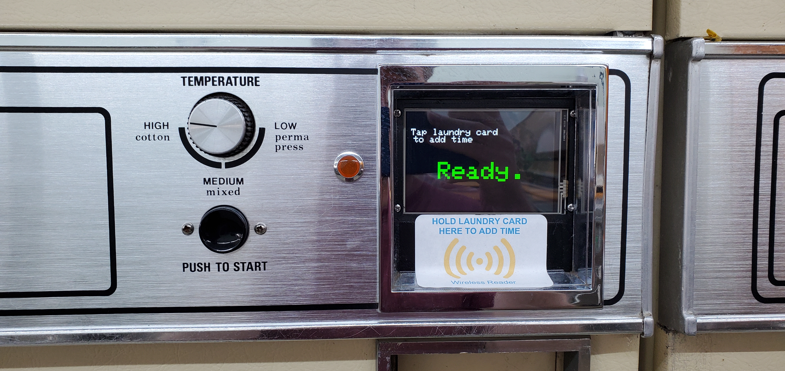 

Video: [Dryer Start](Images/20260927_091349%20[x264].mp4)

It's hard to see in the video but as I hold the card up to the reader it starts by adding 5 minutes and then adds another 5 minutes. As timer mode is cumulative so every tap (or the longer you hold) will continue to add time up to your card balance.

Video: [Dryer Countdown](Images/20260927_091349%20[x264].mp4)

Video: [Kiosk](Images/balancechecker.mp4)

The balance checker kiosk is what I use to load and refund customer cards and guest cards (Blue fob in the video).

The project is broken into a few parts:

1. The project files for the esp32 micro controllers written in C++ using Visual Studio Code.
2. 3D files for the dryer boxes. Made to fit a Huebsch 30EG Dryer circa 1960s. Made in Blender.
3. PCB board to interface the different parts. Made in EasyEDA.

The old dryer coin drop which would accept quarters and rotate a gear and ratchet to push two switches and activate the dryer:
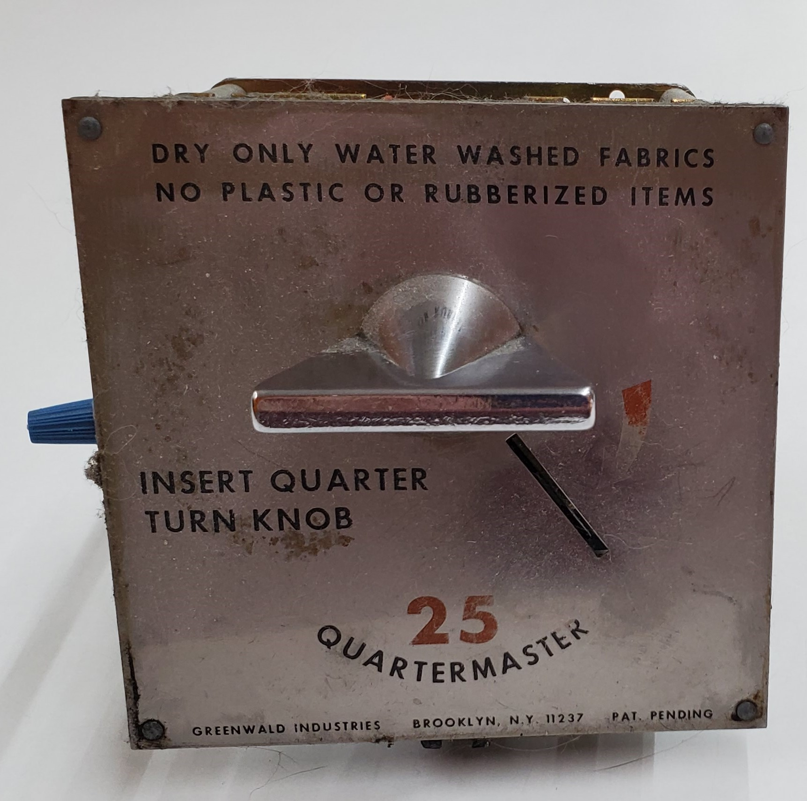
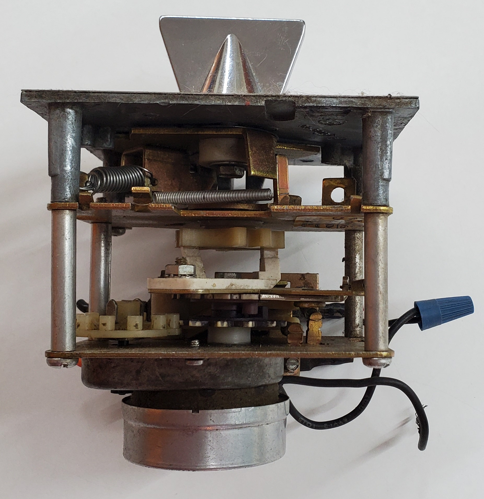
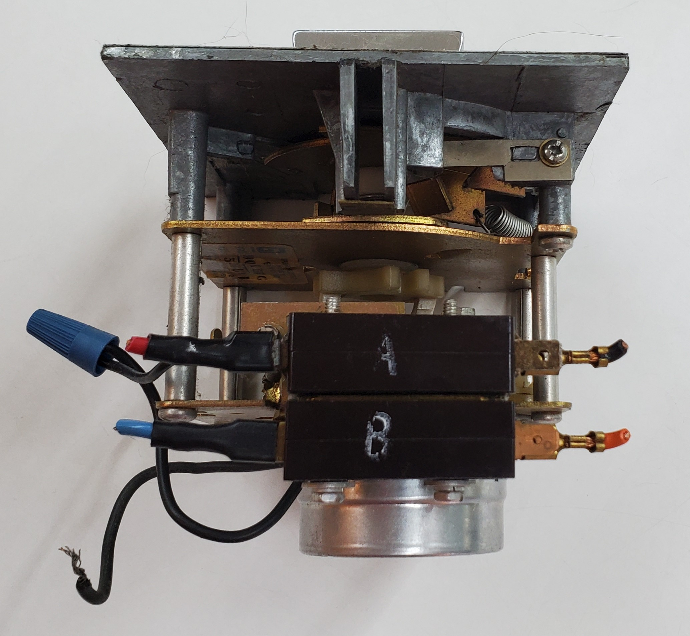<br />
So they've been $0.25 per 5 min for 60 years. (Or the really cheap, that figured out a Nickel would usually work too)

I tried to make the system as modular as possible so that any one module can fail and be easily replaced without tossing the whole works. I did manage to blow up a relay module putting the front panel back on and it shorted to ground. *Ka-POW* and a puff of smoke. So, again, *LINE VOLTAGE... SCARY*

A Partially assembled dryer box:<br />
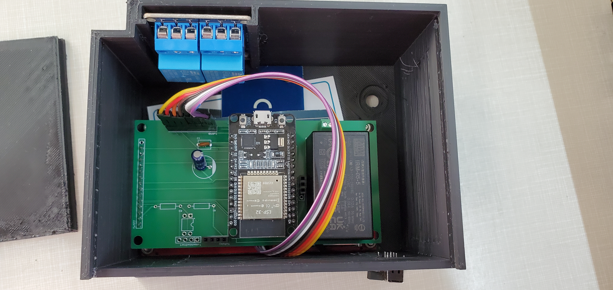
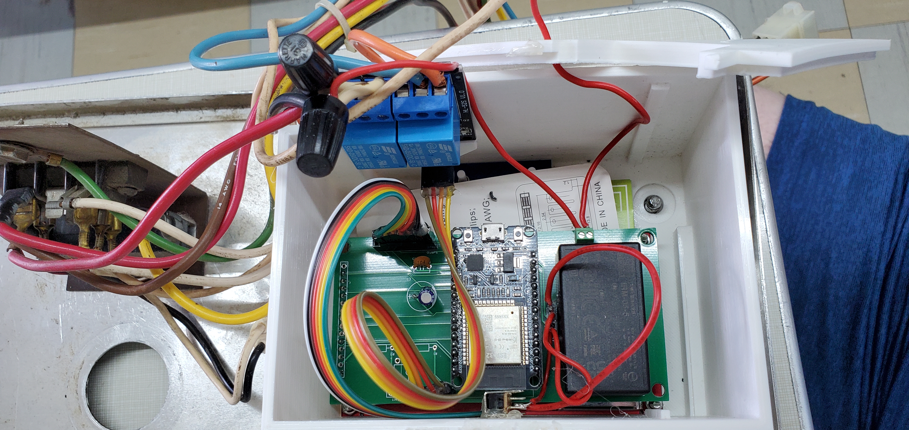

I have yet to make a box for the washer:<br />
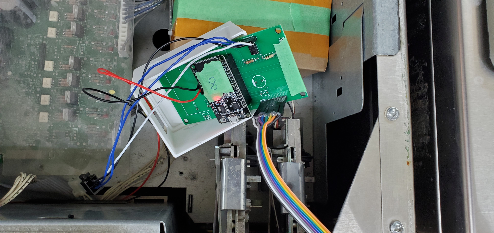

What the initial test looked like:<br />
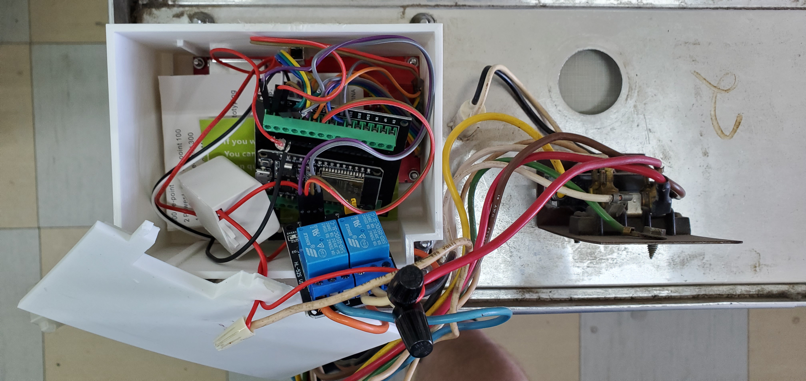

The PCB just have to snip the resistor leads:<br />
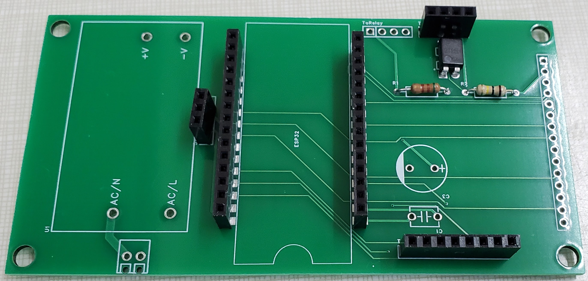
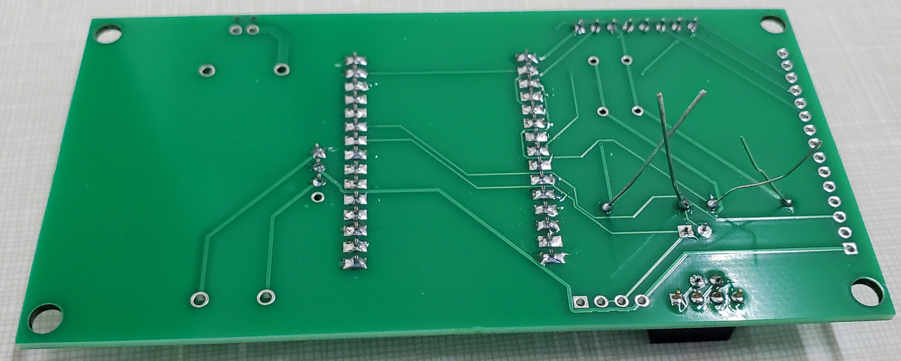

I designed the PCB to directly piggyback the lcd screen to save space and avoid the extra wiring.<br />
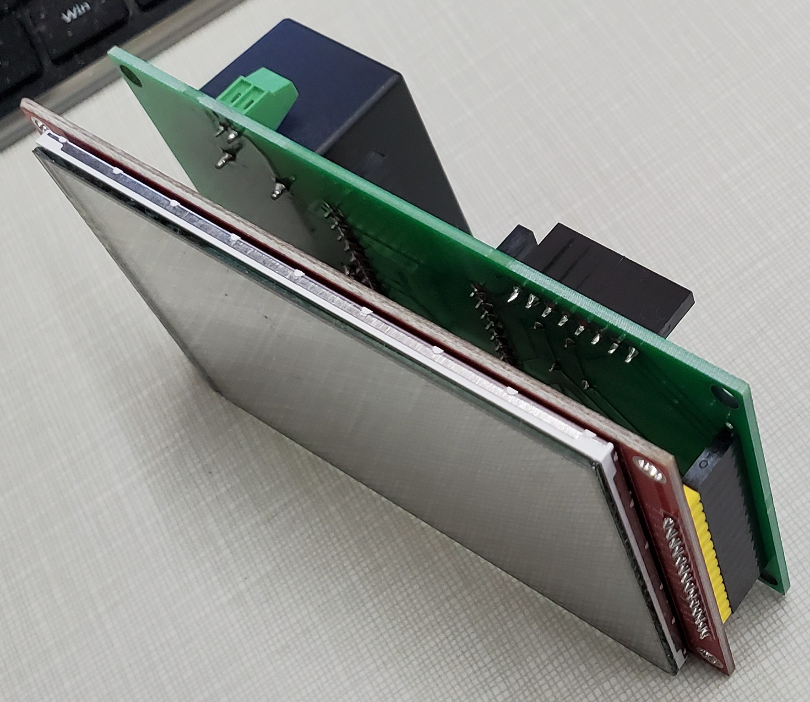


BOM:

ASA Filament for the Dryer boxes. PLA won't cut it as the dryer heat will warp it. <br />
1 x ESP32 Dev board. Specifically: 30PIN ESP32S ESP-WROOM-32 I use [this one](https://www.amazon.ca/dp/B0BQJ8BTVB?th=1)<br />
1 x 5mm LED <-- For Washer as a status indicator<br />
1 x 100k resistor <-- Washer<br />
1 x 480 Ohm resistor <-- Washer<br />
1 x 100 nF Capacitor (#104) <-- Optional to smooth out RFID Power<br />
1 x 10 uF Capacitor <-- Optional to smooth out RFID Power<br />
1 x [6mm High Side Knob 6 Pin 2 Position DPDT Slide Switch](https://www.amazon.ca/20Pcs-50VAC-Position-Switch-SK22H03/dp/B0BKG6Y4KM) <-- Not the ones I went with as I had a bunch laying around but something similar for on/off.<br />
1 x [IRM-05-5 AC to 5v DC](https://www.digikey.ca/en/products/detail/mean-well-usa-inc/IRM-05-5/7704652) <-- A cheap buck converter isn't the greatest because of the EMI the dryers create. Needed if you can't find a 5v supply.<br />
1 x [AQY212EH Solid State Photo-Coupled Relay (Photorelay)](https://www.digikey.ca/en/products/detail/panasonic-industry/AQY212EH/512405) <-- Photo Relay for Washer<br />
1 x [Two Channel Relay Module](https://www.aliexpress.com/item/10000000669335.html?spm=a2g0o.order_list.order_list_main.147.36d618020lMnqG) <-- OR Two Channel Relay for Dryer<br />
1 x [RC522 RFID Module](https://www.digikey.ca/en/products/detail/sunfounder/CN0090/18668629) <-- *Be very wary of cheap knockoffs on Amazon and AliExpress I ended up scrapping 25 of them* Even the official ones I have to reset them every minute because they have a tendency to stop working. <br />
2 x [15-pin connection header](https://www.digikey.ca/en/products/detail/sullins-connector-solutions/PPTC151LFBN-RC/810153) <-- To mount the esp32 to the PCB<br />
1 x [14-pin connection header](https://www.digikey.ca/en/products/detail/sullins-connector-solutions/PPTC141LFBN-RC/810152) <-- To connect the LCD to the PCB<br />
1 x [8-pin connection header](https://www.digikey.ca/en/products/detail/sullins-connector-solutions/PPTC081LFBN-RC/810147) <-- To Connect the RFID to the PCB<br />
3 x [4-pin connection header](https://www.digikey.ca/en/products/detail/sullins-connector-solutions/PPTC041LFBN-RC/810144)<br />
1 x [2-pin block terminal 2.54MM PCB](https://www.digikey.ca/en/products/detail/phoenix-contact/1725656/267462)<br />
1 x [4PIN Male for PC Computer ATX CPU Power Connector](https://www.aliexpress.com/item/32607655535.html?spm=a2g0o.order_list.order_list_main.50.36d618020lMnqG)<br />
1 x [4 inch LCD Display](https://www.aliexpress.com/item/1005005787550807.html?spm=a2g0o.order_list.order_list_main.65.36d618020lMnqG)<br />
Dupont Wire Male to Female:<br />
8-pins for RFID<br />
4-pins for Relay<br />
I couldn't find a source of just male to female so went with [ELEGOO 120pcs 20cm Multicolored Dupont Wire](https://www.amazon.ca/dp/B01EV70C78?th=1) or [RGBZONE 120pcs 20CM Multicolored Dupont](https://www.amazon.ca/dp/B01M1IEUAF?th=1)<br />
Also used them as wires for the switches<br />

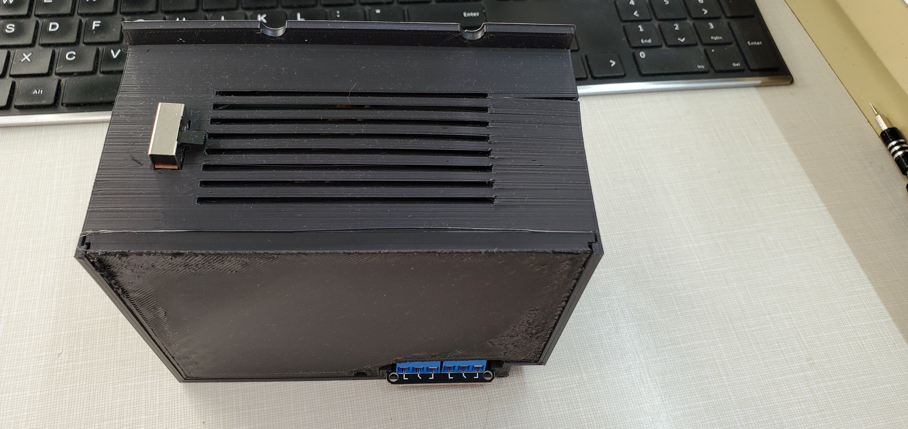

# Setup and Provisioning:
I'm going to assume a couple things so I'll glaze over installing the right drivers ([cp2102](https://www.silabs.com/software-and-tools/usb-to-uart-bridge-vcp-drivers?tab=downloads)) to talk to the esp32 and setting up PlatformIO on VS Code.

Upon initial flash the esp32 will go into provisioning mode. 
Here you can enter the wifi SSID and Password along with the login information for the controller to talk to the server. 
Once you press the "Connect & Save" button the esp32 will reboot and attempt to connect. If successful the config will be saved and you are good to go! If the login to wifi or the server fail it will reboot back to provisioning mode.

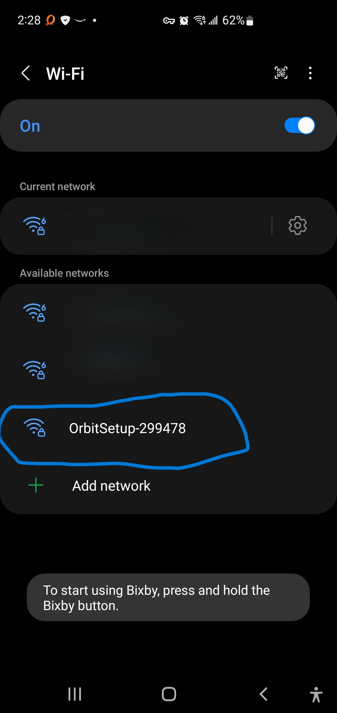
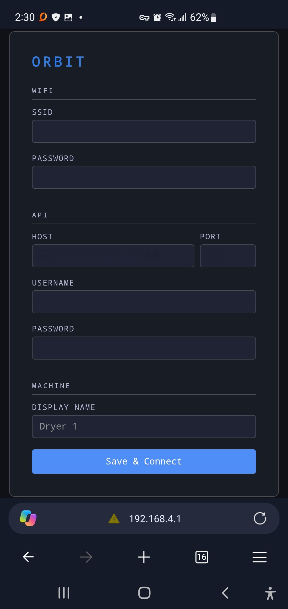

A few notes here:
The wifi must be 2.4GHz. 
The password shouldn't have any special characters in it. You might have better luck with that but I had to go Alphanumeric between all the microprocessors I have in the laundromat.
The server port is actually default port 80 unencrypted. Then switches to the specified port with SSL if port 80 failed. I found the wakeup to init into SSL was too long and people would get frustrated waiting for at least 2 seconds for the connection to be made. 

# Config in profiles:
In the platformio.ini file we can use build_flags to control some fundamental parts in the firmware:

```
    -D HAS_DISPLAY <-- When included the display will be used and when excluded the whole display library is skipped. The washer doesn't have a screen in my laundromat so this is off in the washer profile.
    -D HAS_TOUCH <-- Optional but follows the same logic as HAS_DISPLAY. When touch is enabled on the dryers it dims the screen and brightens when in use or touched.
    -D HAS_LED_RED <-- For the washers the rfid box has a red LED that will turn red upon tap and blink if there is insufficient funds. 
    -D RELAY_ON_START <-- While booting should the relay be on (Off by default). I use this on the dryer so that when the controller reboots it keeps the dryer running until it's back up and connected again.
    -D RELAY_ACTIVE=false <-- Used to indicate if the relay is closed when idle or open. Typically one would want open (Off) when idle.
    -D HAS_MACHINE_BUSY <-- Tells the esp32 to listen to the machine to determine if its running or not. While the machine is running extra taps should be ignored.
    -D FIRMWARE_PROFILE='"dev"' <-- The profile is used during OTA updating.
    -D FIRMWARE_VERSION='"1.1.2"' <-- The firmware version. Update this when making changes.
```

Config.h has some settings that can be adjusted:

```
API_HOST <-- Can be ignored. Set during provisoning.
API_PORT <-- Can be ignored. More in the provisioning section.
testInitDnsHost <-- The host to attempt to ping on boot as a network test. Doesn't affect functionality and is only useful when connected to serial or to monitor on the firewall.
CLEAR_PROVISION <-- Tells the esp32 to clear settings on boot. Needed when you want to reset the firmware to default. For instance changing the wifi password or login info on the esp32.
CLEAR_CLIENT_PREFS <-- Clears the login token on boot so the esp32 will always call /login rather than reusing the bearer token in memory.
HEARTBEAT_INTERVAL_MS <-- How often to send a heartbeat to the server. Default: 30000UL
HEARTBEAT_TIMEOUT_MS <-- How long a heartbeat should be missed before rebooting to attempt a reconnection. Default: 600000UL
TAP_COOLDOWN_MS <-- How long a card has to be visible to the reader before a new tap is registered. Used in cumulative mode. Default: 1000UL
WAKEUP_COOLDOWN_MS <-- How long between resetting the RFID reader. Default: 10000UL
ACCUM_COMMIT_OFFSET_MS <-- A buffer to wait when the card disappears before committing to deduct funds. Default: 200UL
BALANCE_DISPLAY_MS <-- How long to show the new balance on screen after funds have been deducted. Default: 10000UL
```
<br />
Globals.h

```
CONFIG_FETCH_INTERVAL_MS <-- Determines how often to get config from the server.
```

<br />
Globals.cpp stores the global variables used in the program. One variable to take not of in here is the "Amount". The default value of Amount should be set to the default price of the machines.<br /> 
I've recently had an issue with my VM Host playing up and temporarily locking up the server VM causing the controllers to reboot very infrequently. When they do reboot if they don't get a config right away this will be the amount they deduct during tap until the next time they get a config.<br />

```
double        Amount              = 5;
```

One thing to be aware of: The GFX Library for Arduino in PlatformIO is missing "esp32-hal-periman.h"<br />
```
.pio\libdeps\dev\GFX Library for Arduino\src\databus\Arduino_ESP32SPI.h
.pio\libdeps\washer\GFX Library for Arduino\src\databus\Arduino_ESP32SPI.h
.pio\libdeps\dryer\GFX Library for Arduino\src\databus\Arduino_ESP32SPI.h
```

Lines 21 & 22 need to be commented out if it complains:

```
//#include "esp32-hal-periman.h"
//#include "esp_private/periph_ctrl.h"
```

# Endpoints used:

Currently the API server I am using Orbit Blue server is closed source, But these are the endpoints the firmware uses and what they expect. Written in C#/.NET.

## POST "/Login"
Logs into the server with the username and password of the machine and then stores the bearer token data to refresh its login. 

Body: 
```
String body = "{\"username\":\"" + username + "\",\"password\":\"" + password + "\"}";
```
Response:
```
{
"accessToken": string,
"refreshToken": string,
"accessExpiresUtc": Iso8601,
"refreshExpiresUtc": Iso8601
}
```
---
## POST "/refresh"
Renew the login bearer token.

Body:
```
String body = "\" + _refreshToken + "\"";
```
Response:
```
{
"accessToken": string,
"refreshToken": string,
"accessExpiresUtc": Iso8601,
"refreshExpiresUtc": Iso8601
}
```

Iso8601 Format: YYYY-MM-DDTHH:MM:SS
Example: 2026-02-28T20:43:46.8152824+00:00

---
## GET "/accounts/current"
Used to validate the bearer token. On error attempt to log in again.
The response content is ignored here. Only that we get a 200 OK response or not. 

---
## GET "/machineconfig/current"
Gets the config from the server. Same as the UpdateConfig command from heatbeat.

Response:
```
{
  "timerMode" : bool,    <-- True: The controller should hold the relay open for cycleLengthSeconds. This is cumulative. False: the controller will pulse out to the machine start pin.
  "cycleLengthSeconds : ulong, <-- How long each tap should run for when in timer mode.
  "amount" : double, <-- How much each tap costs.
  "coinMode" : bool, <-- Coin mode determines if the controller should pulse out once for machine start or pulse repeatedly to simulate a coin drop signal. 
  "coinCount" : int, <-- The number of coin pulses to send in coin mode.
  "coinPulseDuration" : int, <-- How long the machine start and coin pulses should stay "on"
  "coinPulseDelay" : int, <-- How long to wait between coin drop pulses 
  useMachineBusy" : bool, <-- If the machine has a machine busy pin use it to update status with running and ignore taps until the machine is finished.
  "busyCooldownSeconds" : int, <-- If the machine does not have a busy pin then this is how long the controller will issue a status of busy and ignore further taps. Gives a good estimate of when a washer is busy but has no status pin.
  "screenTimeout" : int, <-- How long the screen should stay bright before dimming. 
  "timeRemaining" : int <-- When in timer mode if the esp32 controller has rebooted this can be used to tell the controller how long it has left on the current cycle.
}
```

---
## POST /machines/heartbeat
Send a status update to the server and gets a command from the server if there is one. 

Body:
```
switch (status) {
  case MachineStatus::Running:    statusStr = "Running";    break;
  case MachineStatus::Error:      statusStr = "Error";      break;
  case MachineStatus::OutOfOrder: statusStr = "OutOfOrder"; break;
  default:                        statusStr = "Idle";       break;
}

String body = {"status": status}
```
Response:
```
{
  "command": command string,
  "commandPayload", ""
}

Command String can be one of:

  "" <-- Empty no orders.
  "TryAgain"
  "AddTime" <-- commandPayload will be an int counting the number of seconds to add.
  "Cancel"
  "Reboot"
  "OutOfOrder"
  "InOrder"
  "UpdateFirmware" <-- commandPayload will be either empty or the profile to download "kiosk", "washer", or "dryer". If empty then the firmware uses whatever FIRMWARE_PROFILE was set to during initial flash.
  "UpdateConfig" <-- commandPayload will be a json object containing the controllers config:

{
  "timerMode" : bool,    <-- True: The controller should hold the relay open for cycleLengthSeconds. This is cumulative. False: the controller will pulse out to the machine start pin.
  "cycleLengthSeconds : ulong, <-- How long each tap should run for when in timer mode.
  "amount" : double, <-- How much each tap costs.
  "coinMode" : bool, <-- Coin mode determines if the controller should pulse out once for machine start or pulse repeatedly to simulate a coin drop signal. 
  "coinCount" : int, <-- The number of coin pulses to send in coin mode.
  "coinPulseDuration" : int, <-- How long the machine start and coin pulses should stay "on"
  "coinPulseDelay" : int, <-- How long to wait between coin drop pulses 
  useMachineBusy" : bool, <-- If the machine has a machine busy pin use it to update status with running and ignore taps until the machine is finished.
  "busyCooldownSeconds" : int, <-- If the machine does not have a busy pin then this is how long the controller will issue a status of busy and ignore further taps. Gives a good estimate of when a washer is busy but has no status pin.
  "screenTimeout" : int, <-- How long the screen should stay bright before dimming. 
  "timeRemaining" : int <-- When in timer mode if the esp32 controller has rebooted this can be used to tell the controller how long it has left on the current cycle.
}

```

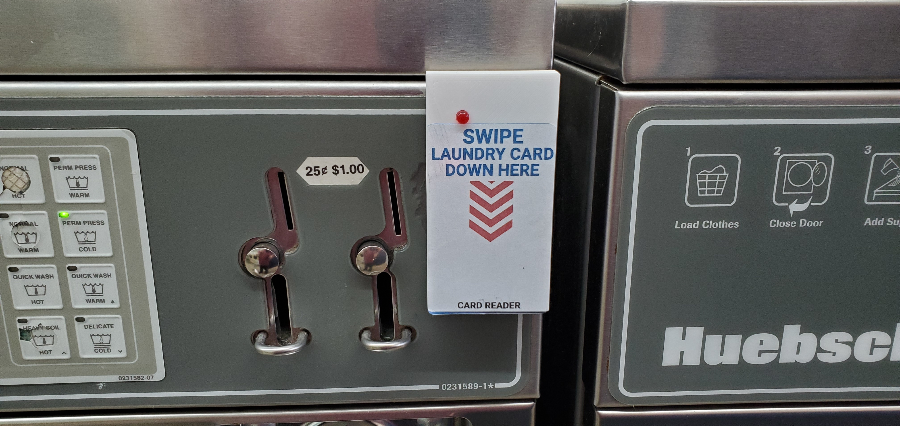

---
## POST /tap/deduct
Deduct / remove funds from a customer account given the card id.

Body:
```
String body = {"cardId": "string",  <-- The Hex ID of the RFID card. Must match a card in the database.
    "accountId": "string", <-- Originally used to identify the machine sending the deduct. Now unused always Guid.Zero
    "amount": number, <-- The amount to deduct from that customer account.
    "processorName": "CASH" <-- Processor is kind of a hint to say how this transaction was performed. Currently the firmware is set to "Cash"
    };
```
Response:
```
{
"message": string, <-- A string message if there was a problem.
"newBalance": 0.00, <-- The new account balance
"accountDisplayName": string <-- the Display name of the customer account. Currently unused by the Firmware. 
}
```

---
## POST /tap/refund
Removes funds to the customer account given the card id. Can be marked as refunded on the server to differentiate from a machine using their funds.

Body:
```
{
    "cardId": string,  <-- The Hex ID of the RFID card. Must match a card in the database.
    "amount": number, <-- The amount to refund from that customer account.
    "processorName":"CASH" <-- Processor is kind of a hint to say how this transaction was performed. Currently the firmware is set to "Cash"
}
```
Response:
```
{
"message": string, <-- A string message if there was a problem.
"newBalance": 0.00, <-- The new account balance
"accountDisplayName": string <-- the Display name of the customer account. Currently unused by the Firmware. 
}
```

---
## POST /tap/add
Add funds to the customer account given the card id.

Body:
```
{
    "cardId": string,  <-- The Hex ID of the RFID card. Must match a card in the database.
    "amount": number, <-- The amount to add to that customer account.
    "processorName": "CASH" <-- Processor is kind of a hint to say how this transaction was performed. Currently the firmware is set to "Cash"
}
```
Response:
```
{
"message": string, <-- A string message if there was a problem.
"newBalance": 0.00, <-- The new account balance
"accountDisplayName": string <-- the Display name of the customer account. Currently unused by the Firmware. 
}
```

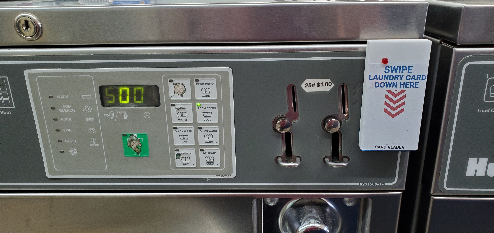

---
## GET "/cards/list?Filters[CardId]=%cardId%"
Used to check if the card being tapped is an admin card. The response can have lots of other details but this is the only field we care about.

Response:
```
{
  rows: [
    {
      isAdminCard: bool
    } 
  ]
}
```

---
## GET "/time"
Currently unused.

---
## GET "/tap/%cardId%/balance"
```
Where %cardId% is the Hex ID of the RFID card
```
Response:
```
{
  "balance": 0.00 <-- The current balance of the customer account for that card.
}
```

---
## GET "/firmware/version?profile=" + profile
Checks to see if the server has a new firmware for an over the air update. 

Response:
```
{
  version: string <-- The version number for example "1.0.17" of the latest version on the server. If the value is different (not necessarily higher) then download the version from the server.
}
```

---
## GET "/firmware/download?profile=" + profile
Download the new firmware from the server and perform an update. As HTTPUpdate on ESP32 Arduino core doesn't support authentication this must be \[AllowAnonymous\].

Response:
```
File: application/octet-stream
```


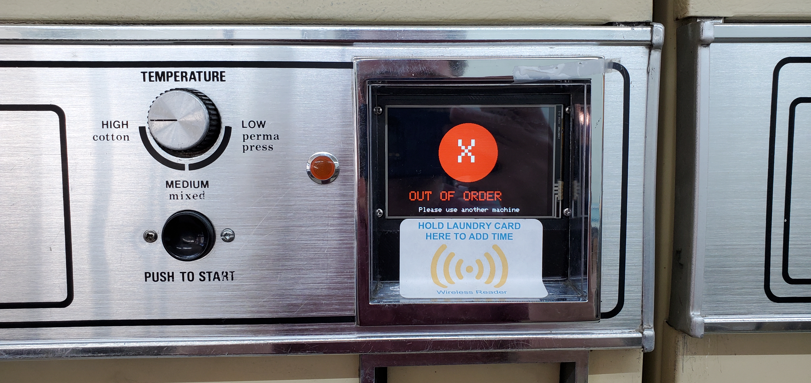

There was a bit of trial and error getting the right components, learning about counterfeit electronics, and iterating through what works and what works better.
But, it has been a great project and tons of fun to go through the whole process learning how the machines work and how to interface with them. 

Hopefully, you might find this as a useful starting point for your own hardware projects. Happy building!
